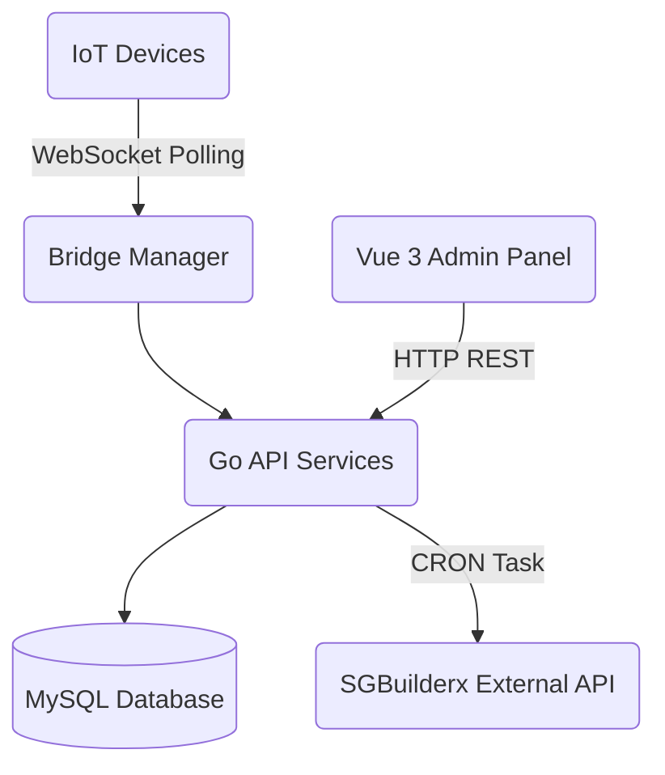

# System Architecture for CPD-Nexus

This document covers the high-level architecture decisions for **CPD-Nexus**—an enterprise-grade attendance tracker and site management gateway compliant with BCA regulations.

---

## 1. High-Level Flow 

1. **IoT Edge Gateways**: Biometric and sensory devices deployed on construction sites perform local verifications. Over a secure WebSocket (`wss://`) bridge connection, these devices act as an inbound event stream. 
2. **Go Backend (Unified API & Bridge)**: The scalable Go server coordinates connection handlers mapping events via hardware `SerialNumber`. 
3. **Database Layer (MySQL)**: Standardized mapping of IoT metadata, tenant (users), and worker IDs enables lightning-fast association when time-in and time-out events hit the `AttendanceHandler`.  
4. **Vue 3 Frontend**: Role-gated dashboard (Manager vs Client viewpoints) retrieves the serialized data through REST controllers, giving operators immediate tracking metrics and allocation oversight.
5. **Scheduler/Submitter Module**: Runs autonomous CRON tasks checking the `attendance` records table for pending payloads and submitting compliance packets (`MD` / `MU`) nightly to the official SGBuilderx API endpoints.

---

## 2. Infrastructure Patterns

### Decoupled Domains
The Go backend utilizes an adapter-port pattern.
* `Ports (Interfaces)` definition ensures the API controllers don't inherently touch the database adapter.
* `Services` orchestrate domain knowledge (like calculating a fallback Designated Trade or evaluating missing UUID mappings).  
* `Adapters` connect solely to standard library features (like generic MySQL drivers or WebSocket upgrades). 

### Auto-Sequenced IDs
Rather than fragmented UUIDs, `CPD-Nexus` generates linear indexed strings prefixed by domain models (e.g. `device_002`, `site_005`). This provides human-readable context directly in raw payloads making cross-referencing and debugging highly efficient for enterprise technical support streams.

### State Reconciliation
Because device connections can drop due to real-world power outages or LTE loss on remote sites, `Manager.go` utilizes contextual CRON timing to poll (`FETCH_ATTENDANCE`) upon reconnect, pulling batched chunks grouped by sequence to patch offline intervals. 

---

## 3. Maintenance Guide
* **API Versioning**: Located inside `backend/internal/api/router.go`. 
* **Database Updates**: Apply subsequent `0XX_schema_name.sql` scripts found inside `backend/migrate/` to the primary database instance. Do not modify pre-existing sequences.
* **Component Styling**: All global variables strictly exist under `frontend-vue/src/assets/styles/index.css` via custom design token specifications.
