# CPD-Nexus 代码库审计报告

> **审计时间**: 2026-03-06  
> **审计范围**: 完整代码库 (backend Go + frontend-vue Vue.js)  
> **项目**: Construction Project & Data Nexus — 建筑行业项目管理 + BCA合规数据提交平台

---

## 📊 总体评估

| 维度 | 评分 | 说明 |
|------|------|------|
| **架构设计** | ⭐⭐⭐⭐ | 六边形架构 (Ports & Adapters) 层次分明，职责清晰 |
| **安全性** | ⭐⭐ | 存在多个 **严重** 安全缺陷，需立即修复 |
| **代码质量** | ⭐⭐⭐ | 整体可读，但存在重复及违反分层原则 |
| **可测试性** | ⭐ | **零测试覆盖**，完全没有 `_test.go` 文件 |
| **可维护性** | ⭐⭐⭐ | 文档质量优秀，但部分代码具有紧耦合问题 |
| **前端质量** | ⭐⭐⭐ | 结构合理，API层封装良好 |

---

## 🚨 严重问题 (Critical)

### 1. 🔴 认证完全绕过 — 密码校验已禁用

**文件**: [auth_service.go](file:///d:/WorksOfWenting/CPD-Nexus/backend/internal/core/services/auth_service.go#L20-L36)

```go
func (s *AuthService) Login(ctx context.Context, username, password string) (string, *domain.User, error) {
    user, err := s.repo.GetByUsername(ctx, username)
    // ...
    // Password check skipped as per schema update
    // if err := bcrypt.CompareHashAndPassword([]byte(user.PasswordHash), []byte(password)); err != nil {
    // 	return "", nil, errors.New("invalid credentials")
    // }
    token := "mock-jwt-token-" + uuid.New().String()
    return token, user, nil
}
```

> [!CAUTION]
> **任何用户名都可以登录，无需密码**。bcrypt密码验证已被注释掉，登录函数只要用户存在即返回成功。这意味着：
> - 知道任何用户名即可获取完全访问权限
> - Token 是伪造的 mock 值，无签名验证，无过期机制
> - 这不仅是开发遗留问题，而是 **生产环境中的安全灾难**

**修复建议:**
1. 恢复 `bcrypt.CompareHashAndPassword` 密码验证
2. 用 JWT 库 (如 `golang-jwt/jwt`) 替换 `"mock-jwt-token-"` 
3. 在中间件中验证 JWT 签名和过期时间
4. Token 应包含 `userID`、`role`、`exp` 等 claims

---

### 2. 🔴 X-User-ID Header 伪造漏洞 — 任意用户冒充

**文件**: [auth_middleware.go](file:///d:/WorksOfWenting/CPD-Nexus/backend/internal/api/middleware/auth_middleware.go#L21-L38)

```go
func UserScopeMiddleware(next http.Handler) http.Handler {
    return http.HandlerFunc(func(w http.ResponseWriter, r *http.Request) {
        userID := r.Header.Get("X-User-ID")    // 客户端可任意设置！
        if userID == "" {
            userID = r.URL.Query().Get("user_id") // URL参数也可伪造！
        }
        // ... 直接信任，无任何验证
    })
}
```

> [!CAUTION]
> 多租户隔离的核心依赖 `X-User-ID` header，但该 header **完全由客户端控制**，没有与 JWT token 进行关联验证。攻击者只需修改 header 即可访问任何用户的数据。

**修复建议:**
1. `userID` 应从 JWT token 的 claims 中提取，而不是 header
2. 移除 URL query parameter `user_id` 的后备逻辑
3. 硬编码的 `vendorAdminID = "Owner_001"` 应改为基于角色的 RBAC

---

### 3. 🔴 SQL 注入风险 — 字符串拼接构建查询

**文件**: [worker_repo.go](file:///d:/WorksOfWenting/CPD-Nexus/backend/internal/adapters/repository/mysql/worker_repo.go#L66)

```go
func (r *WorkerRepository) List(ctx context.Context, userID, siteID string) ([]domain.Worker, error) {
    query := workerBaseSelect + " WHERE w.status = '" + domain.StatusActive + "'"
    // ...
}
```

**同样出现在**: [worker_repo.go:200](file:///d:/WorksOfWenting/CPD-Nexus/backend/internal/adapters/repository/mysql/worker_repo.go#L200)
```go
query := workerBaseSelect + " WHERE w.is_synced = ? AND w.status = '" + domain.StatusActive + "'"
```

> [!WARNING]
> 虽然 `domain.StatusActive` 目前是硬编码常量 `"active"`，不存在当前注入风险，但这种 **字符串拼接 SQL** 的模式极其危险：
> - 如果将来 `StatusActive` 变为动态值，即构成注入
> - 违反了代码库自身声明的 "使用参数化查询" 原则  
> 
> 应统一使用 `WHERE w.status = ?` 参数化方式。

---

### 4. 🔴 文件上传无安全校验

**文件**: [upload.go](file:///d:/WorksOfWenting/CPD-Nexus/backend/internal/api/handlers/upload.go#L13-L81)

```go
func UploadFaceHandler(w http.ResponseWriter, r *http.Request) {
    r.ParseMultipartForm(10 << 20) // 10MB
    file, handler, err := r.FormFile("image")
    // ... 
    filename := time.Now().Format("20060102150405") + "_" + handler.Filename
    savePath := filepath.Join(uploadSubDir, filename)
    dst, err := os.Create(savePath)
    // ...
}
```

> [!CAUTION]
> **多项安全问题:**
> 1. **无文件类型验证** — 可上传 `.exe`、`.php`、`.sh` 等任意文件
> 2. **文件名未清洗** — `handler.Filename` 可能包含 `../../etc/passwd` 等路径穿越攻击载荷
> 3. **无文件大小限制执行** — `ParseMultipartForm(10<<20)` 仅限制内存缓冲，磁盘可无限写入
> 4. **无MIME类型检查** — 不验证上传内容是否真的是图片

**修复建议:**
```go
// 1. 验证 Content-Type
allowedTypes := map[string]bool{"image/jpeg": true, "image/png": true}
if !allowedTypes[handler.Header.Get("Content-Type")] {
    http.Error(w, "Only JPEG/PNG allowed", 400)
    return
}
// 2. 用 UUID 替代原始文件名
filename := uuid.New().String() + filepath.Ext(handler.Filename)
// 3. 验证文件头 magic bytes
```

---

## ⚠️ 重要问题 (High)

### 5. 🟠 PitstopService 违反六边形架构 — Service 直接依赖 Adapter

**文件**: [pitstop_service.go](file:///d:/WorksOfWenting/CPD-Nexus/backend/internal/core/services/pitstop_service.go#L6-L14)

```go
import "sgbuildex/internal/adapters/external/sgbuildex"

type PitstopService struct {
    pitstopClient  *sgbuildex.Client  // ❌ 直接引用外部 adapter 具体类型
}
```

> [!IMPORTANT]
> [ARCHITECTURE.md](file:///d:/WorksOfWenting/CPD-Nexus/ARCHITECTURE.md) 明确规定 Services 层 **不能直接依赖 adapter 具体类型**，应通过 Port 接口解耦。当前 [PitstopService](file:///d:/WorksOfWenting/CPD-Nexus/backend/internal/core/services/pitstop_service.go#12-19) 直接持有 `*sgbuildex.Client` 指针和调用 `sgbuildex.SubmitPayloads()` / `sgbuildex.MapAttendanceToManpower()`，完全违反了架构约束。

**修复**: 为 SGBuildex client 定义一个 Port 接口（例如 `ports.ExternalSubmitter`）。

---

### 6. 🟠 WorkerRepository 违反分层 — Repository 依赖 API 中间件

**文件**: [worker_repo.go](file:///d:/WorksOfWenting/CPD-Nexus/backend/internal/adapters/repository/mysql/worker_repo.go#L7)

```go
import "sgbuildex/internal/api/middleware" // ❌ Repository 不应知道 HTTP 层
```

[worker_repo.go](file:///d:/WorksOfWenting/CPD-Nexus/backend/internal/adapters/repository/mysql/worker_repo.go) 中直接调用 `middleware.IsVendor(ctx)` 来决定 SQL 查询策略。这违反了架构文档中规定的 Repositories **不能导入 handlers/middleware**。

**修复**: Vendor 状态应作为参数传入，或在 service 层处理。

---

### 7. 🟠 Duplicate SyncStatus 常量定义

**文件对比**: 
- [worker.go](file:///d:/WorksOfWenting/CPD-Nexus/backend/internal/core/domain/worker.go#L3-L7): `SyncStatusPendingUpdate=0, SyncStatusSynced=1, SyncStatusPendingRegistration=2`
- [constants.go](file:///d:/WorksOfWenting/CPD-Nexus/backend/internal/core/domain/constants.go#L8-L11): `SyncStatusUpdate=0, SyncStatusReady=1, SyncStatusPending=2`

> [!WARNING]
> 同一个概念有 **两套不同名称** 的常量，一个在 [worker.go](file:///d:/WorksOfWenting/CPD-Nexus/backend/internal/core/ports/worker.go)，另一个在 [constants.go](file:///d:/WorksOfWenting/CPD-Nexus/backend/internal/core/domain/constants.go)，值完全相同但命名不同。这将导致维护混乱和 bug。

---

### 8. 🟠 CORS 配置硬编码

**文件**: [main.go](file:///d:/WorksOfWenting/CPD-Nexus/backend/cmd/server/main.go#L176-L186)

```go
AllowedOrigins: []string{
    "http://localhost:5173", "http://127.0.0.1:5173",
    "http://localhost:5174", // ... 硬编码了 4 个端口
},
```

生产环境、UAT 环境的域名未配置。部署到正式环境后前端请求将被 CORS 拒绝。应从环境变量读取。

---

### 9. 🟠 Bridge RequestManager 并发安全缺陷

**文件**: [manager.go](file:///d:/WorksOfWenting/CPD-Nexus/backend/internal/bridge/manager.go#L31-L33)

```go
func (rm *RequestManager) RegisterHandler(msgType string, h Handler) {
    rm.Handlers[msgType] = h  // ❌ 未加锁，直接写 map
}
```

[Transports](file:///d:/WorksOfWenting/CPD-Nexus/backend/internal/bridge/manager.go#66-77) map 有 `sync.RWMutex` 保护，但 `Handlers` map 没有任何锁保护。虽然当前仅在启动时写入，但这违反了并发安全原则。

---

### 10. 🟠 Context.Background() 在 Bridge 中的误用

**文件**: [manager.go](file:///d:/WorksOfWenting/CPD-Nexus/backend/internal/bridge/manager.go#L82)

```go
tasks, err := rm.BridgeRepo.GetActiveBridgeWorkers(context.Background()) // 应使用传入的 ctx
```

[RequestAttendance()](file:///d:/WorksOfWenting/CPD-Nexus/backend/internal/bridge/manager.go#78-141) 方法没有接受 `context.Context` 参数，内部使用 `context.Background()` 创建不可取消的上下文。在优雅关闭时，这些数据库查询不会被中断。

---

### 11. 🟠 Submitter 中的 `append` slice 共享陷阱

**文件**: [submitter.go](file:///d:/WorksOfWenting/CPD-Nexus/backend/internal/adapters/external/sgbuildex/submitter.go#L57-L58)

```go
nextParticipants := append(batchParticipants, req.Participants...)
nextPayload := append(batchPayload, req.Payload...)
```

> [!WARNING]
> `append` 在 Go 中不保证返回新 slice —— 如果原 slice 容量足够，会修改原 slice 底层数组。应使用 `slices.Clone()` 或 `make` + `copy` 来保证隔离。

---

### 12. 🟠 HTTP 响应体未关闭 (submitter.go 错误路径)

**文件**: [submitter.go](file:///d:/WorksOfWenting/CPD-Nexus/backend/internal/adapters/external/sgbuildex/submitter.go#L120-L132)

```go
if err != nil {
    status = "failed"
    errorMessage = err.Error()
    // ❌ 如果 err != nil 但 resp != nil (某些 HTTP 库行为)，resp.Body 未关闭
} else {
    if resp.StatusCode >= 400 { ... }
    resp.Body.Close()  // 仅在 err == nil 时关闭
}
```

应使用 `defer resp.Body.Close()` 模式确保资源释放。

---

## 📝 中等问题 (Medium)

### 13. 🟡 零测试覆盖率

整个 `backend/` 目录中 **没有一个 `_test.go` 文件**。对于处理政府合规数据提交 (BCA/SGTradeX) 的系统，这是不可接受的。

> [!IMPORTANT]
> **优先级测试建议:**
> 1. `validation/sgbuildex_rules_test.go` — NRIC/UEN/Trade 规则
> 2. `services/worker_service_test.go` — 同步状态转换逻辑
> 3. `sgbuildex/mappers_test.go` — Attendance → ManpowerUtilization 映射
> 4. `sgbuildex/submitter_test.go` — 批量提交、大小限制、rate limiting

---

### 14. 🟡 go.mod 模块名与项目名不匹配

**文件**: [go.mod](file:///d:/WorksOfWenting/CPD-Nexus/backend/go.mod#L1)

```
module sgbuildex
```

项目已更名为 `CPD-Nexus`，但 Go 模块名仍为 `sgbuildex`。所有 import 路径都引用 `sgbuildex/internal/...`。虽不影响功能，但造成认知混乱。

---

### 15. 🟡 冗余/空文件

| 文件 | 问题 |
|------|------|
| [extractor.go](file:///d:/WorksOfWenting/CPD-Nexus/backend/internal/adapters/external/sgbuildex/extractor.go) | 仅包含 `package sgbuildex`，完全空文件 |
| [util.go](file:///d:/WorksOfWenting/CPD-Nexus/backend/internal/adapters/external/sgbuildex/util.go) vs [utils.go](file:///d:/WorksOfWenting/CPD-Nexus/backend/internal/adapters/external/sgbuildex/utils.go) | 两个文件功能重叠，[util.go](file:///d:/WorksOfWenting/CPD-Nexus/backend/internal/adapters/external/sgbuildex/util.go) 仅有一个 Health 方法 |
| [dataexchange.go](file:///d:/WorksOfWenting/CPD-Nexus/backend/internal/adapters/external/sgbuildex/dataexchange.go) | [PushEvent](file:///d:/WorksOfWenting/CPD-Nexus/backend/internal/adapters/external/sgbuildex/dataexchange.go#8-20) 方法使用 `c.BaseURL`，而 [PostJSON](file:///d:/WorksOfWenting/CPD-Nexus/backend/internal/adapters/external/sgbuildex/client.go#36-67) 使用 `c.PitstopURL` —— URL 使用策略不一致 |

---

### 16. 🟡 硬编码默认数据库凭据

**文件**: [config.go](file:///d:/WorksOfWenting/CPD-Nexus/backend/internal/pkg/config/config.go#L32-L33)

```go
DBUser: getEnv("DB_USER", "bas_user"),
DBPass: getEnv("DB_PASS", "new_password"),  // 硬编码默认密码
```

`.env` 文件未配置时将使用硬编码凭据。应在环境变量缺失时直接报错退出。

---

### 17. 🟡 Worker Update 使用 `map[string]interface{}` 而非强类型 DTO

**文件**: [workers.go](file:///d:/WorksOfWenting/CPD-Nexus/backend/internal/api/handlers/workers.go#L76)

```go
var payload map[string]interface{}
json.NewDecoder(r.Body).Decode(&payload)
```

[UpdateWorker](file:///d:/WorksOfWenting/CPD-Nexus/backend/internal/core/services/worker_service.go#113-257) handler 接受无结构化的 `map[string]interface{}`。这导致：
- 无编译期类型检查
- `float64` vs `int` 的 JSON 数字解析需要多处 type switch
- 无法自动生成 API 文档 (Swagger)

---

### 18. 🟡 Bridge RequestID 不具唯一性

**文件**: [types.go](file:///d:/WorksOfWenting/CPD-Nexus/backend/internal/bridge/types.go#L38)

```go
RequestID: fmt.Sprintf("req-%s", time.Now().Format("20060102150405")),
```

同一秒内发送多个请求将产生相同的 `RequestID`，无法正确关联请求/响应。应使用 `uuid.New()` 或加纳秒级时间戳。

---

### 19. 🟡 `successIDs` 变量已声明但从未使用

**文件**: [manager.go](file:///d:/WorksOfWenting/CPD-Nexus/backend/internal/bridge/manager.go#L169-L191)

```go
var successIDs []string
// ...
successIDs = append(successIDs, workerID)
// ❌ successIDs 在函数结束后被丢弃，未做任何处理
```

---

### 20. 🟡 前端 Token 未进行有效性验证

**文件**: [http.js](file:///d:/WorksOfWenting/CPD-Nexus/frontend-vue/src/api/http.js#L73-L76)

```javascript
const token = localStorage.getItem('auth_token');
if (token) {
    config.headers['Authorization'] = `Bearer ${token}`;
}
```

前端存储 `mock-jwt-token-xxx` 并发送给后端，但后端 **从不验证** 这个 token。`Authorization` header 完全是装饰性的。

---

## 💡 改进建议 (Low)

### 21. 日志记录应使用结构化 Logger

多处代码混用 `log.Printf` 和 `logger.Infof/Errorf`。应统一使用 `internal/pkg/logger` 包。

### 22. 缺少请求速率限制

API 无 rate limiting 中间件。高频请求可导致系统资源耗尽。

### 23. 缺少数据库连接池配置

```go
db, err := sql.Open("mysql", cfg.DBDSN) // 默认连接池参数
```

未配置 `SetMaxOpenConns`、`SetMaxIdleConns`、`SetConnMaxLifetime`，在高负载下可能耗尽连接。

### 24. [CreateWorker](file:///d:/WorksOfWenting/CPD-Nexus/backend/internal/core/services/worker_service.go#37-72) 中的 ID 生成存在竞争条件

**文件**: [worker_service.go:42](file:///d:/WorksOfWenting/CPD-Nexus/backend/internal/core/services/worker_service.go#L42)

```go
w.ID = "w" + time.Now().Format("20060102150405")
```

Service 层和 Repository 层 (`idgen.GenerateNextID`) **都在生成 ID**，且 Service 层的时间戳方式在并发场景下会冲突。Repository 层会覆盖 Service 层的 ID，但增加了不必要的混乱。

---

## 📐 架构分析

### ✅ 优点

1. **六边形架构** 层次清晰，大部分代码遵守 Domain → Ports → Services → Adapters 的依赖方向
2. **Domain 模型纯净** — `core/domain/` 仅依赖标准库，无基础设施污染
3. **调度器设计精良** — [DailyScheduler](file:///d:/WorksOfWenting/CPD-Nexus/backend/internal/core/services/scheduler.go#15-22) 支持动态重配置 ([Reset()](file:///d:/WorksOfWenting/CPD-Nexus/backend/internal/core/services/scheduler.go#33-39) channel)，优雅关停
4. **多租户隔离意图明确** — 几乎所有查询都包含 `user_id` 条件
5. **前端 HTTP 抽象良好** — [http.js](file:///d:/WorksOfWenting/CPD-Nexus/frontend-vue/src/api/http.js) 封装了统一的请求、错误处理和 loading 状态管理
6. **BCA 校验规则完备** — [sgbuildex_rules.go](file:///d:/WorksOfWenting/CPD-Nexus/backend/internal/pkg/validation/sgbuildex_rules.go) 涵盖 NRIC/FIN、UEN、Trade、Work Pass 等全量规则
7. **正向/反向数据流文档化** — [ARCHITECTURE.md](file:///d:/WorksOfWenting/CPD-Nexus/ARCHITECTURE.md) 和 [BRIDGE_COMMUNICATION.md](file:///d:/WorksOfWenting/CPD-Nexus/BRIDGE_COMMUNICATION.md) 质量很高

### ❌ 需改进

1. **身份验证形同虚设** — 最核心的安全防线完全缺失
2. **架构违反** — [PitstopService](file:///d:/WorksOfWenting/CPD-Nexus/backend/internal/core/services/pitstop_service.go#12-19) 和 [WorkerRepository](file:///d:/WorksOfWenting/CPD-Nexus/backend/internal/core/ports/worker.go#8-20) 破坏了分层约束
3. **测试为零** — 对于政府合规系统绝对不可接受
4. **关键路径无 retry 机制** — SGBuildex 提交失败后仅标记 `failed`，无自动重试

---

## 🎯 修复优先级建议

```mermaid
gantt
    title 修复优先级路线图
    dateFormat X
    axisFormat %s

    section P0 紧急
    恢复密码验证 + JWT 实现         :crit, 0, 3
    X-User-ID 改为从 Token 提取    :crit, 0, 2
    文件上传安全加固               :crit, 1, 3

    section P1 高优
    SQL 参数化修复                 :2, 3
    架构违反修复 (PitstopService)  :3, 5
    Repository 分层修复            :3, 5
    重复常量清理                   :3, 4

    section P2 中等
    核心模块单元测试               :4, 8
    go.mod 更名                   :5, 6
    连接池配置                    :5, 6
    CORS 环境变量化               :5, 6
    
    section P3 优化
    结构化日志统一                :7, 8
    Rate Limiting                :7, 9
    空文件清理                   :8, 9
```



---

## 📁 文件统计

| 类别 | 文件数 | 估计行数 |
|------|--------|---------|
| Go 后端 (应用代码) | 85 | ~4,500 |
| Go 测试 | 0 | 0 |
| Vue 前端 | ~80+ | ~3,000+ |
| SQL 迁移 | 11 | - |
| 文档 (MD) | 4 | ~600 |

---

> [!NOTE]
> 本审计基于静态代码分析完成，未包含运行时行为验证和渗透测试。建议在完成 P0 修复后进行安全渗透测试。
